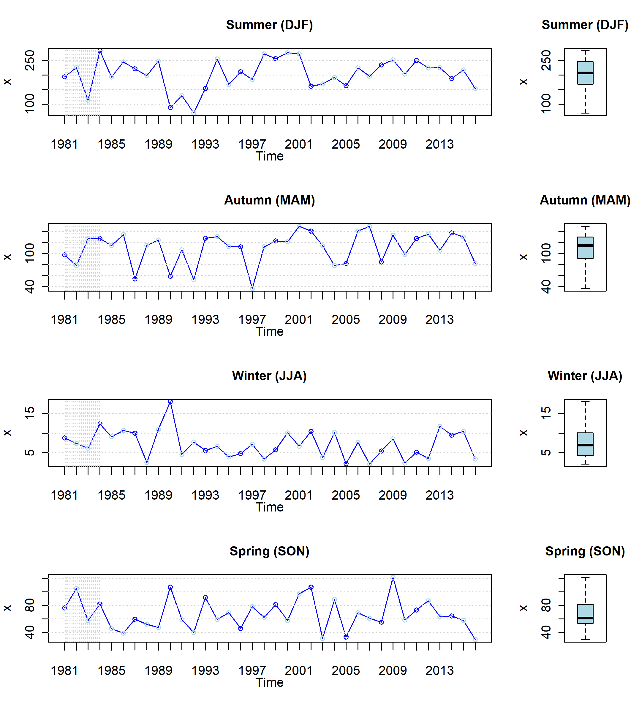

---
# Please do not edit this file directly; it is auto generated.
# Instead, please edit 08-ejemplo-PISCO.md in _episodes_rmd/
title: "Manejando la base de datos PISCO"
teaching: 120
exercises: 60
questions:
- "¿Cómo obtenemos la información grillada PISCO?"
- "¿Cómo leemos la base de datos en R?"
- "¿Cómo extraemos una serie de tiempo para nuestra cuenca?"
- "¿Cómo estimamos las climalotogías de las variables de análisis?"
objectives:
- "Describir el procedimiento para descargar el producto PISCO desde IRI Data Library"
- "Describir el procedimiento para el manejo de la base de datos PISCO"
- "Extraer la serie de tiempo media areal para nuestra cuenca de interés"
- "Determinar la climatología de precipitación y temperatura"
keypoints:
- "Usa RStudio manejar bases de datos en formato netCDF."
- "R tiene funciones estadísticas para describir nuestras series de tiempo."
- "En RStudio se puede realizar operaciones geoespaciales básicas."
source: Rmd
---

## Explorando Iri Data Library

En esta sección accederemos a la base de datos del producto grillado [PISCO](https://www.tandfonline.com/doi/abs/10.1080/02626667.2019.1649411). Para ello, vamos a ingresar a la siguiente website:

  * Acceder a través de la web [Iri Data Library](https://iridl.ldeo.columbia.edu/)
  


* Esta parte del procedimiento se realizará en misma web donde se aloja el producto PISCO
* Se debe descargar el producto PISCO precipitación y temperatura máxima y mínima y guardar en la carpeta de trabajo (data)

## Leyendo la base de datos descargada

Comencemos con definir la ruta de nuestra carpeta de trabajo:


```r
dir <- 'C:/directorio/de/trabajo/'
setwd(dir)
```

> ## Sugerencia
>
> La ruta donde se localiza nuestra carpeta de trabajo no debe contener espacios
> ni caracteres a fin de evitar problemas en lo sucesivo. Dentro de ésta
> se debe de tener subcarpetas con los siguientes nombres:
> 
> * `/code`: donde guardemos los **scripts** que vayamos generando
> * `/data`: donde almacenemos la base de datos que vamos a descargar 
> * `/result`: donde guardemos los archivos y gráficos generados
>
{: .callout}

## Instalando los paquetes necesarios para leer la base de datos

Si no se tiene instalada la libreria `raster`, proceder como sigue a continuación:


```r
if (!require(raster)) install.packages("raster")
library(raster)
```
## Leer el producto PISCO descargado (base de datos de precipitación mensual)

Si no se tiene instalada la libreria `raster`, proceder como sigue a continuación:

* Leer el archivo `netCDF`

```r
pr <- brick('../data/pr.nc')
crs(pr) <- '+proj=longlat +datum=WGS84 +no_defs'
plot(pr[[1]])
```

* Leer el shapefile de la cuenca de estudio

```r
mask <- shapefile('../shp/rimac.shp')
plot(mask,add=T)
```

Deberíamos obtener algo como esto

<figure>
  
</figure>

* Ahora vamos a remuestrear los datos PISCO a una resolución más fina para estimar la media areal

> ## Sugerencia
> Para ello vamos a crear una función, tal como se muestra a continuación:
> ~~~
> # Función para estimar la media areal del producto PISCO usando un shape de cuenca
> getMean <- function(x,mask){
>  x1 <- crop(x,extent(mask)*1.5)
>  x2 <- raster(x1)
>  res(x2) <- c(0.005,0.005)
>  x2 <- resample(x1,x2,method='ngb')
>  x3 <- mask(x2,mask)
>  TS <- cellStats(x2, 'mean')
>  return(TS)
> }
> ~~~
> {: .language-r}
{: .callout}

~~~
# Aplicando la función
TSpp <- getMean(pr,mask)
~~~
{: .language-r}

* Una serie de tiempo debe de estar referida a un vector de fechas 

~~~
# Vector de fechas
ini <- as.Date(as.character("1981/01/15"),format="%Y/%m/%d")
fin <- as.Date(as.character("2016/12/15"),format="%Y/%m/%d")
fechas <- seq(ini,fin,by="month")
~~~
{: .language-r}

* Con los vectores de fechas y la serie de precipitación media areal creamos nuestra `dataframe`

~~~
# Creando dataframe y guardando la serie de tiempo
df <- data.frame(fechas,as.numeric(TSpp))
colnames(df) <- c('dates','pp')
head(df)
tail(df)
write.csv(df,'../data/pp_hist.csv',row.names = F)
~~~
{: .language-r}

> ## Desafío 1
>
> Realizar el mismo procedimiento para la base de datos de temperatura máxima y mínima
>
> > ## Solución al desafío 1
> >
> > La idea es utilizar la función creada previamente para estimar los medios areales de
> > la cuenca de estudio.
> >
> > ~~~
> > # Obteniendo los medios areales de Tmax y Tmin
> > tmax <- brick('../data/tmax.nc')
> > tmin <- brick('../data/tmin.nc')
> > TStmax <- getMean(tmax,mask)
> > TStmix <- getMean(tmin,mask)
> > df_tmax <- data.frame(fechas,as.numeric(TStmax))
> > colnames(df_tmax) <- c('dates','tmax')
> > df_tmin <- data.frame(fechas,as.numeric(TStmin))
> > colnames(df_tmin) <- c('dates','tmin')
> > ~~~
> > {: .language-r}
> {: .solution}
{: .challenge}

## Análisis exploratorio de datos hidrometeorológicos

Vamos a realizar un análisis exploratorio de las series de tiempo generadas a fin de conocer la naturaleza estadítica de la información.

* En primer lugar vamos a instalar los `packages` necesarios para llevar a cabo nuestra tarea

~~~
# Instalando el paquete hydroTSM
if (!require(devtools)) install.packages("devtools")
library(devtools)
install_github("hzambran/hydroTSM")
library(hydroTSM)
~~~
{: .language-r}

* Luego vamos a plotear la serie de tiempo

~~~
# Manejando la serie de tiempo de precipitación y estimando sus estadísticos de resumen
x <- zoo(df$pp,df$dates)
plot(x,ylab='Total montly rainfall (mm)')
dates <- time(x)
( nyears <- yip(from=start(x), to=end(x), out.type="nmbr" ) )
smry(x)
~~~
{: .language-r}

Deberían obetener algo como lo mostrado en la siguiente Figura:

<figure>
  
</figure>

* Para guardar los estadísticos de resumen y un gráfico de la serie de tiempo, se puede proceder como sigue

~~~
# Para guaradar los estadíticos de resumen y un gráfico de la serie de tiempo de precipitación
write.csv(smry(x),'../data/SumStats.csv',row.names = TRUE)
png('../data/exploratoryAnalysis.png',units = "cm",width = 15,height = 10,res = 300)
hydroplot(x, var.type="Precipitation",# main="at San Martino",
          pfreq = "ma", na.rm = TRUE,var.unit = "mm")
dev.off()
~~~
{: .language-r}

El gráfico genereado debería de ser como el siguiente:

<figure>
  
</figure>

* El siguiente paso consiste en determinar la matriz de datos de para adjuntarla en el informe

~~~
# Crear una matriz de datos
M <- matrix(x, ncol=12, byrow=TRUE)
colnames(M) <- month.abb
rownames(M) <- unique(format(time(x), "%Y"))
M
~~~
{: .language-r}

* Ahora vamos a generar un gráfico para analizar la distribución temporal de la lluvia en la cuenca

~~~
# Instalar el siguiente paquete 
if (require(lattice)) install.packages("lattice")
library(lattice)

## Generando gráfico de calor
png('../data/heatMapMPp.png',units = "cm",width = 15,height = 10,res = 300)
print(matrixplot(M, ColorRamp="Precipitation",
                 main="Monthly precipitation, [mm/month]"))
dev.off()

monthlyfunction(x, FUN=median, na.rm=TRUE)
cmonth <- format(time(x), "%b")
months <- factor(cmonth, levels=unique(cmonth), ordered=TRUE)

## Generando gráfico de cajas
png('../data/boxplotMonth.png',units = "cm",width = 15,height = 10,res = 300)
boxplot( coredata(x) ~ months, col="lightblue", main="Monthly Precipitation",
         ylab="Precipitation, [mm]", xlab="Month")
dev.off()
~~~
{: .language-r}

Deberían obtener el siguiente gráfico:

<figure>
  
</figure>

* Vamos a estimar la precipitación total por estación

~~~
# Agregando la precipitación por estación
seasonalfunction(x, FUN=sum, na.rm=TRUE) / nyears

( DJF <- dm2seasonal(x, season="DJF", FUN=sum) )
( MAM <- dm2seasonal(x, season="MAM", FUN=sum) )
( JJA <- dm2seasonal(x, season="JJA", FUN=sum) )
( SON <- dm2seasonal(x, season="SON", FUN=sum) )

png('../data/seasonalAnalysis.png',units = "cm",width = 18,height = 20,res = 300)
hydroplot(x, pfreq="seasonal", FUN=sum, stype="default", season.names=c("Summer","Autumn", "Winter","Spring"))
dev.off()
~~~
{: .language-r}

Deberían obtener lo siguiente:

<figure>
  
</figure>

* Ahora vamos a identificar si nuestra serie de tiempo es independiente y estacionaria (si presenta saltos o tendencias)

~~~
# Vamos a instalar el `wql` para lograrlo
install_github("jsta/wql",force = TRUE)
library(wql)

## better ACF plot
plot.acf <- function(ACFobj) {
  rr <- ACFobj$acf[-1]
  kk <- length(rr)
  nn <- ACFobj$n.used
  plot(seq(kk), rr, type = "h", lwd = 2, yaxs = "i", xaxs = "i", 
       ylim = c(floor(min(rr)), 1), xlim = c(0, kk + 1), xlab = "Lag", 
       ylab = "ACF", las = 1)
  abline(h = -1/nn + c(-2, 2)/sqrt(nn), lty = "dashed", col = "blue")
  abline(h = 0)
}

## better PACF plot
plot.pacf <- function(PACFobj) {
  rr <- PACFobj$acf
  kk <- length(rr)
  nn <- PACFobj$n.used
  plot(seq(kk), rr, type = "h", lwd = 2, yaxs = "i", xaxs = "i", 
       ylim = c(floor(min(rr)), 1), xlim = c(0, kk + 1), xlab = "Lag", 
       ylab = "PACF", las = 1)
  abline(h = -1/nn + c(-2, 2)/sqrt(nn), lty = "dashed", col = "blue")
  abline(h = 0)
}
~~~
{: .language-r}

~~~
## ACF de la serie de tiempo
pp.acf <- acf(coredata(DJF), lag.max = 10)
## correlogram of the ppmax24hr data

## PACF de la serie de tiempo
pp.pacf <- pacf(coredata(DJF), lag.max = 10)
## correlogram of the ppmax24hr data


png('../data/Autocorrelation.png',units = "cm",width = 15,height = 8,res = 300)
plot.pacf(pp.pacf)
dev.off()

(trend <- mannKen(data.frame(DJF),plot=TRUE))
(pettit <- pett(data.frame(DJF)))

write.csv(trend,'../data/mannKendall.csv',row.names = TRUE)
write.csv(pettit,'../data/pettit.csv',row.names = TRUE)
~~~
{: .language-r}

<br>


