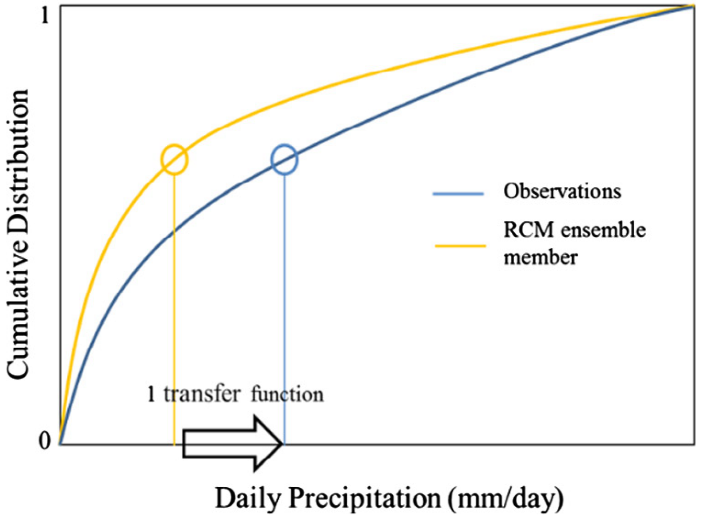
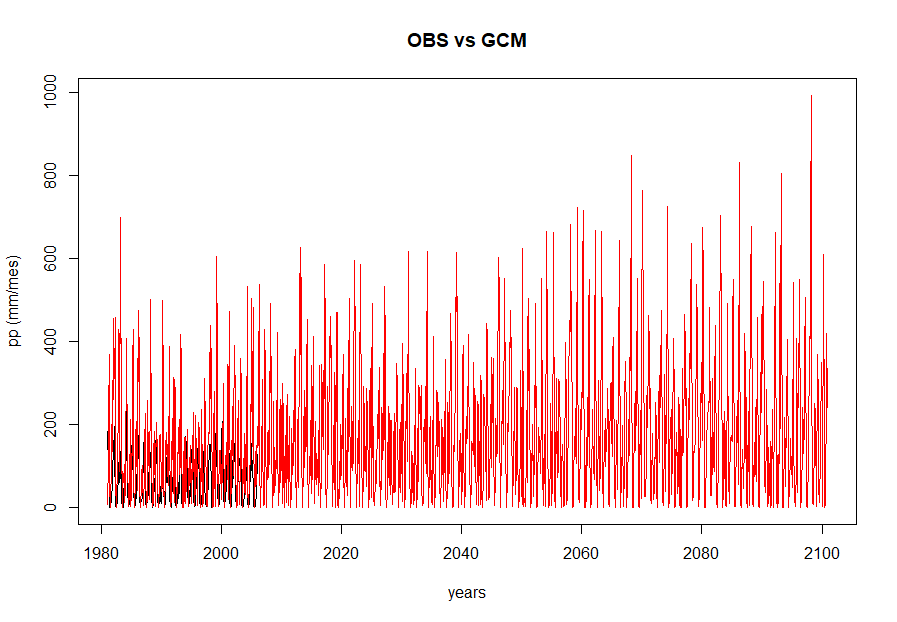
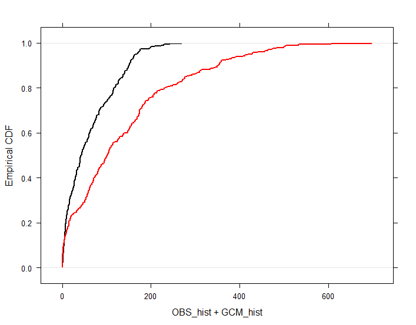
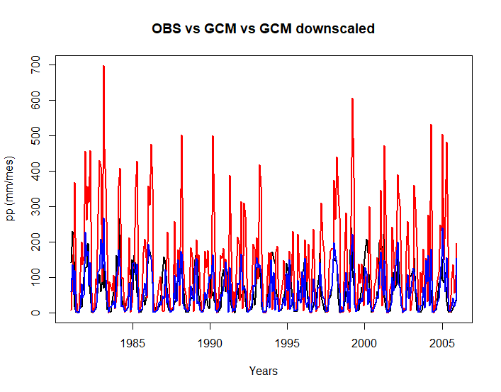
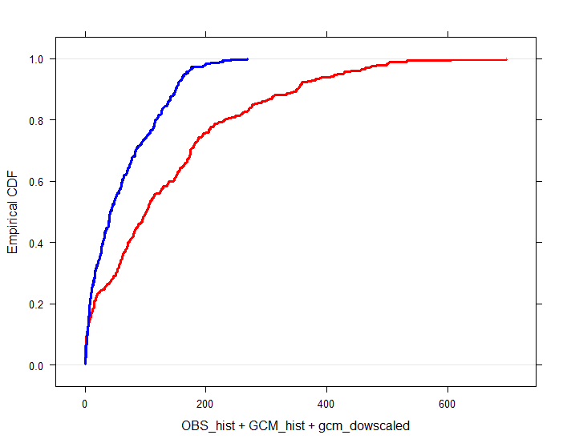
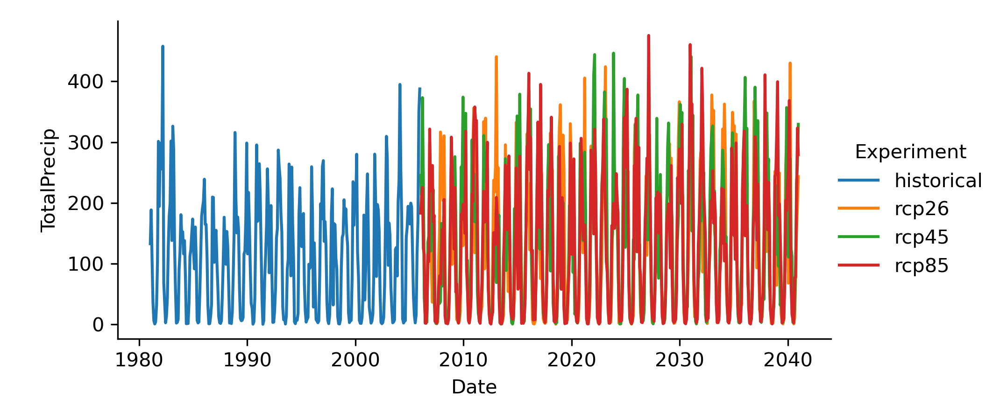
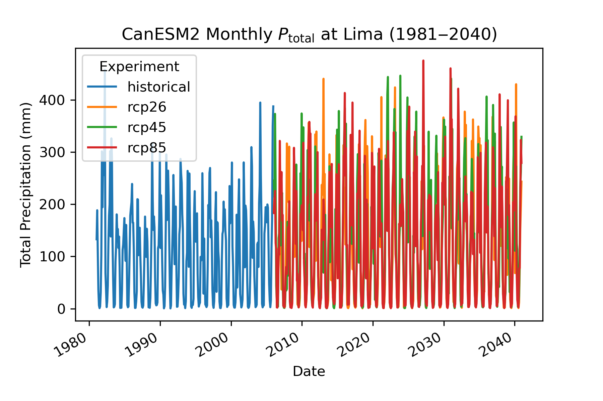

---
# Please do not edit this file directly; it is auto generated.
title: "Regionalización estadística de las salidas de los GCM"
teaching: 45
exercises: 135
questions:
- "¿Cómo realizamos la regionalización de las salidas de los GCM?"
objectives:
- "Describir el procedimiento para la regionalización de las salidas de los GCM"
keypoints:
- "R nos ayuda a sistematizar el procedimiento de regionalización de las salidas de los GCM."
source: Rmd
---

## Introducción

### Regionalización estadítica de las salidas de los GCM: el método Quantile-Mapping

La idea básica en este método es la de ajustar la distribución empírica de probabilidad acumulada de cada uno de las salidas de los GCM a la de la serie de datos observados.

<figure>
  
</figure>

Puede revisar la siguiente información para un mayor alcance:

1. [Bias correction capabilities of quantile mapping methods for rainfall and temperature variables](https://iwaponline.com/jwcc/article-abstract/doi/10.2166/wcc.2020.261/74161/Bias-correction-capabilities-of-quantile-mapping?redirectedFrom=fulltext).
2. [Probability Distributions for a Quantile Mapping Technique for a Bias Correction of Precipitation Data: A Case Study to Precipitation Data Under Climate Change](https://www.mdpi.com/2073-4441/11/7/1475/pdf).
3. [Impact of bias correction and downscaling through quantile mapping on simulated climate change signal: a case study over Central Italy](https://hal.inrae.fr/view/index/identifiant/hal-02623508).

## Explorando la información descarga de los GCM

En esta lección, vamos a desarrollar el procedimiento estandar para regionalizar las series de tiempo de precipitación y temperatura máxima y mínima. 

Empezamos abriendo un **script** en RStudio y definir dónde se localiza el proyecto e importamos las bibliotecas que vamos a usar.

Comencemos con definir la ruta de nuestra carpeta de trabajo:

## Instalando los paquetes necesarios para leer la base de datos

Si no se tiene instalada la libreria `qmap, zoo y latticeExtra`, proceder como sigue a continuación:

~~~
# ..............................................................................
# INSTALAR Y CARGAR LOS PAQUETES NECESARIOS

install.packages(c("qmap", "zoo", "latticeExtra"))

# CARGAR LAS LIBRERIAS
library(qmap)
library(zoo)
library(latticeExtra)

dir <- 'C:/Users/Computer/Documents/R/unalm/code/'
setwd(dir)
~~~
{: .language-r}

## Cargar las series de tiempo de las variables de interés

Aquí vamos a utilizar la serie de tiempo media areal de cada una de nuestras subcuencas, tanto para la precipitación, como la temperatura máxima y mínima

~~~
#...............................................................................
# CARGANDO LOS ARCHIVOS NECESARIOS

# Seleccionamos la variable y el modelo que descargamos en la lección anterior
w <- 2 # Numero de subcuenca
var <- 'tasmax' # Variable a analizar 
if(var == 'pr'){
  file <- 'prec'
  target <- '/pp_hist.csv'
  ylabel <- "pp (mm/mes)"
}else if(var == 'tasmax'){
  file <- 'tmax'
  target <- '/tmax_hist.csv'
  ylabel <- "tmax (°C/mes)"
}else{
  file <- 'tmin'
  target <- '/tmin_hist.csv'
  ylabel <- "tmin (°C/mes)"
}
model <- 'ACCESS1-3' # Salida GCM
# Lista de los GCM descargados
dataset <- list.files(paste0('../result/',file,'/',w,'/'),pattern = var)
subset <- dataset[grep(model,dataset)]
subset
# Seleccionamos el archivo específico
which <- 2 # 2:N
~~~
{: .language-r}

Cargamos la información histórica y los GCM

~~~
# Observacion historica PISCO
OBS_hist <- read.zoo(paste0('../result/',file,'/',w,target), header = TRUE, sep = ",",
                     format = "%Y-%m-%d")
OBS_hist <- window(OBS_hist, end = "2005-12-15")

# Observacion del modelo GCM
GCM_model <- read.zoo(paste0('../result/',file,'/',w,'/',subset[1]), header = TRUE, sep = ",", 
                      format = "%Y-%m-%d")
GCM_model1 <- read.zoo(paste0('../result/',file,'/',w,'/',subset[which]), header = TRUE, sep = ",", 
                      format = "%Y-%m-%d")
GCM_model <- rbind(GCM_model, GCM_model1)
GCM_model <- window(GCM_model, start = "1981-01-15")
~~~
{: .language-r}

Ahora vamos a seleccionar la serie de tiempo del periodo comprendido entre 1981 y 2005

~~~
# Ajustando la serie hasta diciembre 2005
GCM_hist <- window(GCM_model, end = "2005-12-15")

data_at <- cbind(OBS_hist, GCM_model)
data_wt <- cbind(OBS_hist, GCM_hist)   
~~~
{: .language-r}

## Vamos a hacer unos gráficos

En esta parte vamos a hacer un plot para verificar las series de tiempo con las que estamos trabajando

~~~
# ..............................................................................
# GRAFICANDO LAS SERIES DE TIEMPO
plot(data_at, plot.type = "single", col = c(1, 2), lwd = 1, 
     main = c("OBS vs GCM"), ylab = ylabel, xlab = "years")

plot(data_wt, plot.type = "single", col = c(1, 2),  lwd = 1, 
     main = c("OBS vs GCM"), ylab = ylabel, xlab = "years")

plot(data_wt[months(time(data_wt)) %in% c("December","January","February")], 
     plot.type = "single", col = c(1, 2),  lwd = 1, type='p', 
     main = c("OBS vs GCM"), ylab = ylabel, xlab = "years")

# GRAFICANDO SCATTERPLOT
plot(GCM_hist~OBS_hist, coredata(data_wt), col = c(1,2))

plot(GCM_hist~OBS_hist,
     coredata(data_wt[months(time(data_wt)) %in% 
                        c("December","January","February")]), col = c(1,2))

# GRAFICANDO ECDF
ecdfplot(~ OBS_hist +  GCM_hist, data = data.frame(data_wt), 
         lwd = 2, col = c(1, 2))

ecdfplot(~ OBS_hist +  GCM_hist,
         data = data.frame(data_wt[months(time(data_wt)) %in% 
                                     c("December","January","February")]), 
         lwd = 2, col = c(1, 2))
~~~
{: .language-r}

Deberíamos obtener un gráfico como el siguiente:

<figure>
  
</figure>

Podemos resaltar que la información presenta un periodo de 1981-2100. Además, que la magnitud del GCM considerado sobreestima lárgamente la serie observada.

<figure>
  
</figure>

## Aplicar el método Quantile-Mapping

Vamos a aplicar el método Quantil-Mapping a datos agrupados según las estaciones del año.

~~~
# ..............................................................................
# SEASONAL QUANTILE EMPIRICAL MAPPING

data_wt$gcm_dowscaled <- data_wt$GCM_hist

seasons_by_year <- list(c("December","January","February"), 
                        c("March","April","May"), 
                        c("June","July","August"),
                        c("September","October","November"))

seasonal_qm_fit_model <- list()

for(i in 1:4) {
  obs_sl <- data_wt[months(time(data_wt)) %in% seasons_by_year[[i]]]$OBS_hist
  mod_sl <- data_wt[months(time(data_wt)) %in% seasons_by_year[[i]]]$GCM_hist
  #MODEL, read!: L. Gudmundsson et al. (2012)
  qm_fit <- fitQmapQUANT(obs = coredata(obs_sl),
                         coredata(mod_sl),
                         qstep = 0.01,
                         nboot = 1, 
                         wet.day = TRUE, # Adaptado para temperatuas negativas
                         type = "linear")
  
  mod_sl_qmapped <- doQmapQUANT(coredata(mod_sl), qm_fit, type = "linear")
  data_wt$gcm_dowscaled[ months(time(data_wt)) %in%
                           seasons_by_year[[i]]] <- mod_sl_qmapped
  
  seasonal_qm_fit_model[[i]] <- qm_fit 
}
~~~
{: .language-r}

Ahora vamos a hacer unos gráficos para ver los resultados

~~~
# ..............................................................................
# GRAFICANDO
plot(data_wt, plot.type = "single", col = c(1, 2, 4),  lwd = 2, 
     main = c("OBS vs GCM vs GCM downscaled"),
     xlab = "Years", ylab = ylabel)

plot(data_wt[months(time(data_wt)) %in% c("December",
                                          "January",
                                          "February")], 
     plot.type = "single", col = c(1, 2, 4),  lwd = 2, type = "p",
     main = c("OBS vs GCM vs GCM downscaled"), 
     xlab = "Years", ylab = ylabel)

plot(gcm_dowscaled~OBS_hist, coredata(data_wt), col = c(4,1))

plot(gcm_dowscaled~OBS_hist, coredata(data_wt[months(time(data_wt)) %in%
                                                c("December",
                                                  "January",
                                                  "February")]), 
     col = c(4,1))

ecdfplot(~ OBS_hist +  GCM_hist + gcm_dowscaled, data = data.frame(data_wt), 
         lwd = 3, col = c(1, 2, 4))

ecdfplot(~ OBS_hist +  GCM_hist + gcm_dowscaled,
         data = data.frame(data_wt[months(time(data_wt)) %in%
                                     c("December","January","February")]), 
         lwd = 3, col = c(1, 2, 4))

ecdfplot(~ OBS_hist + gcm_dowscaled, data = data.frame(data_wt), 
         lwd = 3, col = c(1, 2, 4))

# ..............................................................................
~~~
{: .language-r}

Deberíamos obtener algo como esto:

<figure>
  
</figure>

<figure>
  
</figure>

## Corrección del sesgo de la información

Aplicamos el método Quantil-Mapping para nuestros datos

~~~
# CORRECCIÓN DE LA INFORMACION

data_at$GCM_downscaled <- data_at$GCM_model

for(i in 1:4) {
  mod_sl <- data_at[months(time(data_at)) %in% seasons_by_year[[i]]]$GCM_model
  mod_sl_qmapped <- doQmapQUANT(coredata(mod_sl), seasonal_qm_fit_model[[i]], type = "linear")
  data_at$GCM_downscaled[ months(time(data_at)) %in% seasons_by_year[[i]]] <- mod_sl_qmapped
}
# verificar la nueva tabla y el grafico
View(data_at)

plot(data_at, plot.type = "single", col = c(1, 2, 4), lwd = 1, 
     main = c("OBS vs GCM VS GCM DOWNSCALED"),
     ylab = ylabel, xlab = "years")
~~~
{: .language-r}

Finalmente guardamos la serie corregida.

~~~
# ..............................................................................
# GUARDANDO LOS DATOS AJUSTADOS PARA GCM

write.zoo(data_at[,], file = paste0('../result/',file,'/',w,'/',
                                    substr(subset[which],1,nchar(subset[which])-4),'_corr.csv'), sep = ",")
print("El proceso se ha completado satisfactoriamente!")
~~~
{: .language-r}

## Ahora vamos a aplicar el método Quantile-Mapping para nuestra zona de estudio

La idea es hacer todo el proceso iterando sobre la cantidad de subcuencas.

~~~
# Inside a loop
var <- 'tasmin' # Variable a analizar 
if(var == 'pr'){
  file <- 'prec'
  target <- '/pp_hist.csv'
  ylabel <- "pp (mm/mes)"
}else if(var == 'tasmax'){
  file <- 'tmax'
  target <- '/tmax_hist.csv'
  ylabel <- "tmax (°C/mes)"
}else{
  file <- 'tmin'
  target <- '/tmin_hist.csv'
  ylabel <- "tmin (°C/mes)"
}
model <- 'CanESM2' # Salida GCM

# Leer el shapefile de nuestra cuenca de estudio
mask1 <- shapefile('../raster/prepro_100m/RimacGeog.shp')

for (w in as.numeric(mask1$DN)) {
  # Lista de los GCM descargados
  dataset <- list.files(paste0('../result/',file,'/',w,'/'),pattern = var)
  subset <- dataset[grep(model,dataset)]
  subset
  
  if(length(subset)!=0){
    for (which in 2:length(subset)) {
      # Observacion historica PISCO
      OBS_hist <- read.zoo(paste0('../result/',file,'/',w,target), header = TRUE, sep = ",",
                           format = "%Y-%m-%d")
      OBS_hist <- window(OBS_hist, end = "2005-12-15")
      
      # Observacion del modelo GCM
      GCM_model <- read.zoo(paste0('../result/',file,'/',w,'/',subset[1]), header = TRUE, sep = ",", 
                            format = "%Y-%m-%d")
      GCM_model1 <- read.zoo(paste0('../result/',file,'/',w,'/',subset[which]), header = TRUE, sep = ",", 
                             format = "%Y-%m-%d")
      GCM_model <- rbind(GCM_model, GCM_model1)
      GCM_model <- window(GCM_model, start = "1981-01-15")
      
      # Ajustando la serie hasta diciembre 2005
      GCM_hist <- window(GCM_model, end = "2005-12-15")
      
      data_at <- cbind(OBS_hist, GCM_model)
      data_wt <- cbind(OBS_hist, GCM_hist)
      
      # ..............................................................................
      # SEASONAL QUANTILE EMPIRICAL MAPPING
      
      data_wt$gcm_dowscaled <- data_wt$GCM_hist
      
      seasons_by_year <- list(c("December","January","February"), 
                              c("March","April","May"), 
                              c("June","July","August"),
                              c("September","October","November"))
      
      seasonal_qm_fit_model <- list()
      
      for(i in 1:4) {
        obs_sl <- data_wt[months(time(data_wt)) %in% seasons_by_year[[i]]]$OBS_hist
        mod_sl <- data_wt[months(time(data_wt)) %in% seasons_by_year[[i]]]$GCM_hist
        #MODEL, read!: L. Gudmundsson et al. (2012)
        qm_fit <- fitQmapQUANT(obs = coredata(obs_sl),
                               coredata(mod_sl),
                               qstep = 0.01,
                               nboot = 1, 
                               wet.day = TRUE, # Adaptado para temperatuas negativas
                               type = "linear")
        
        mod_sl_qmapped <- doQmapQUANT(coredata(mod_sl), qm_fit, type = "linear")
        data_wt$gcm_dowscaled[ months(time(data_wt)) %in%
                                 seasons_by_year[[i]]] <- mod_sl_qmapped
        
        seasonal_qm_fit_model[[i]] <- qm_fit 
      }
      
      # ..............................................................................
      
      # ..............................................................................
      
      # CORRECCIÓN DE LA INFORMACION
      
      data_at$GCM_downscaled <- data_at$GCM_model
      
      for(i in 1:4) {
        mod_sl <- data_at[months(time(data_at)) %in% seasons_by_year[[i]]]$GCM_model
        mod_sl_qmapped <- doQmapQUANT(coredata(mod_sl), seasonal_qm_fit_model[[i]], type = "linear")
        data_at$GCM_downscaled[ months(time(data_at)) %in% seasons_by_year[[i]]] <- mod_sl_qmapped
      }
      
      # ..............................................................................
      # GUARDANDO LOS DATOS AJUSTADOS PARA GCM
      
      write.zoo(data_at[,], file = paste0('../result/',file,'/',w,'/',
                                          substr(subset[which],1,nchar(subset[which])-4),'_corr.csv'), sep = ",")
      print("El proceso se ha completado satisfactoriamente!")
    }
  }
}
~~~
{: .language-r}

~~~
[1] "El proceso se ha completado satisfactoriamente!"
[1] "El proceso se ha completado satisfactoriamente!"
[1] "El proceso se ha completado satisfactoriamente!"
[1] "El proceso se ha completado satisfactoriamente!"
[1] "El proceso se ha completado satisfactoriamente!"
[1] "El proceso se ha completado satisfactoriamente!"
[1] "El proceso se ha completado satisfactoriamente!"
[1] "El proceso se ha completado satisfactoriamente!"
[1] "El proceso se ha completado satisfactoriamente!"
[1] "El proceso se ha completado satisfactoriamente!"
[1] "El proceso se ha completado satisfactoriamente!"
[1] "El proceso se ha completado satisfactoriamente!"
[1] "El proceso se ha completado satisfactoriamente!"
[1] "El proceso se ha completado satisfactoriamente!"
[1] "El proceso se ha completado satisfactoriamente!"
[1] "El proceso se ha completado satisfactoriamente!"
[1] "El proceso se ha completado satisfactoriamente!"
[1] "El proceso se ha completado satisfactoriamente!"
[1] "El proceso se ha completado satisfactoriamente!"
[1] "El proceso se ha completado satisfactoriamente!"
[1] "El proceso se ha completado satisfactoriamente!"
[1] "El proceso se ha completado satisfactoriamente!"
[1] "El proceso se ha completado satisfactoriamente!"
[1] "El proceso se ha completado satisfactoriamente!"
[1] "El proceso se ha completado satisfactoriamente!"
[1] "El proceso se ha completado satisfactoriamente!"
[1] "El proceso se ha completado satisfactoriamente!"
[1] "El proceso se ha completado satisfactoriamente!"
[1] "El proceso se ha completado satisfactoriamente!"
[1] "El proceso se ha completado satisfactoriamente!"
[1] "El proceso se ha completado satisfactoriamente!"
[1] "El proceso se ha completado satisfactoriamente!"
[1] "El proceso se ha completado satisfactoriamente!"
~~~
{: .output}

 

<!--

Ahora que hemos descargado las salidas de los GCMs, necesitamos saber cómo acceder a ellos y comenzar a analizarlos. En esta lección, seleccionaremos un subconjunto espacial y temporal de sus datos del GCM que coincidan con su línea base climática observada, y comenzará a comprender el clima futuro utilizando el método **Delta Change**. Al final de este lección, tendrás datos de más de 40 GCMs. Comenzaremos explorando algunos de los atributos de los datos tridimensionales contenidos en los archivos **netCDF** descargados. Se recomienda  que se abra una pestaña del navegador con la [documentación](http://unidata.github.io/netcdf4-python/netCDF4/index.html) de la biblioteca de netCDF4 como referencia.

Empezamos, como siempre, importando las bibliotecas que necesitaremos.

~~~
# Cargamos los paquetes
import datetime as dt
import numpy as np
import pandas as pd
import re
from matplotlib import pyplot as plt
from netCDF4 import Dataset, date2index, num2date, date2num
from calendar import monthrange
~~~
{: .language-python}

Ahora, cree una lista de los archivos netCDF que vamos a examinar. Hemos creado algunos archivos netCDF para usar en esta lección. Si ha seguido este manual en orden, entonces debería sustituir los directorios y nombres de los archivos de abajo con las rutas que conducen a los archivos netCDF que descargó en la lección anterior.

~~~
# Lista de archivos descargados
past = "pr_Amon_CanESM2_historical_r1i1p1_185001-200512.nc"
future = ["pr_Amon_CanESM2_rcp26_r1i1p1_200601-210012.nc", "pr_Amon_CanESM2_rcp45_r1i1p1_200601-210012.nc", "pr_Amon_CanESM2_rcp85_r1i1p1_200601-210012.nc"]
~~~
{: .language-python}

También debemos de cargar las funciones creadas en **Python** para leer archivos **netCDF**.

~~~
# Funciones para leer archivos netCDF
import netCDF4
import textwrap
import warnings

def dump_global_attrs(nc):
    """Print the global attributes of a netCDF file.

    Parameters
    ----------
    nc : netCDF4._netCDF4.Dataset
        The loaded netCDF file to process
    """
    print("Global data set attributes:")
    for attr in nc.ncattrs():
        print(textwrap.fill((attr + ": " + str(getattr(nc, attr))),
                            initial_indent='  ',
                            subsequent_indent=(' ' * (len(attr) + 4))))

def dump_dims(nc, dimensions):
    """Print the attributes of the dimensions of a netCDF file.

    Parameters
    ----------
    nc : netCDF4._netCDF4.Dataset
        The loaded netCDF file to process
    dimensions : list or str
        The names of the dimensions to query
    """
    if type(dimensions) is str:
        dimensions = [dimensions]
    dims_passed = len(dimensions)
    dimensions = [dim for dim in dimensions if dim in nc.dimensions]
    if len(dimensions) != dims_passed:
        warnings.warn("One or more dimensions are invalid. Omitting.")
        if len(dimensions) == 0:
            raise ValueError("No valid dimensions.")

    totdims = len(nc.dimensions)
    if len(dimensions) != totdims:
        print("Data dimensions ({} of {}):".format(len(dimensions), totdims))
    else:
        print("Data dimensions ({} total):".format(totdims))
    for dim in dimensions:
        diminfo = nc.dimensions[dim]
        if diminfo.isunlimited():
            size = "unlimited ({} currently)".format(diminfo.size)
        else:
            size = diminfo.size
        print("  name:", dim)
        print("    size:", size)
        if dim in nc.variables:
            varinfo = nc.variables[dim]
            print("    type:", varinfo.dtype)
            for attr in varinfo.ncattrs():
                print("    {}: {}".format(str(attr), varinfo.getncattr(attr)))

def dump_vars(nc, variables):
    """Print the attributes of the variables of a netCDF file.

    Parameters
    ----------
    nc : netCDF4._netCDF4.Dataset
        The loaded netCDF file to process
    variables : list or str
        The names of the variables to query
    """
    if type(variables) is str:
        variables = [variables]
    vars_passed = len(variables)
    variables = [var for var in variables if var in nc.variables]
    if len(variables) != vars_passed:
        warnings.warn("One or more variables are invalid. Omitting.")
        if len(variables) == 0:
            raise ValueError("No valid variables.")

    totvars = len(nc.variables) - len(nc.dimensions)
    if len(variables) != totvars:
        print("Variables ({} of {}):".format(len(variables), totvars))
    else:
        print("Variables ({} total):".format(totvars))
    for var in variables:
        varinfo = nc.variables[var]
        print("  name:", var)
        print("    dimensions:", varinfo.dimensions)
        print("    size:", varinfo.size)
        print("    type:", varinfo.dtype)
        for attr in varinfo.ncattrs():
            if attr == "associated_files":
                files = varinfo.getncattr(attr).split(" ")
                print((' ' * 4) + attr + ":")
                for i in range(1, len(files), 2):
                    print(textwrap.fill("{} {}".format(files[i-1], files[i]),
                                        initial_indent=(' ' * 6),
                                        subsequent_indent=(' ' * (len(attr) +
                                                                  8))))
            else:
                print(textwrap.fill("{}: {}".format(attr,
                                                    varinfo.getncattr(attr)),
                                    initial_indent=(' ' * 4),
                                    subsequent_indent=(' ' * (len(attr) + 6))))

def ncdump(nc):
    """Print the global, dimension, and variable attributes a netCDF file.

    Parameters
    ----------
    nc : str or netCDF4._netCDF4.Dataset
        Either a filename of a netCDF file or the loaded netCDF data set
        to process
    """
    if type(nc) not in [str, netCDF4._netCDF4.Dataset]:
        raise TypeError("You must pass a valid filename or a loaded data set.")
    if type(nc) is str:
        filename = nc
        try:
            nc = netCDF4.Dataset(filename)
        except FileNotFoundError:
            raise ValueError("We could not read that netCDF file. Check the \
                             filename.")
        print(">> Getting data for file", filename)

    dump_global_attrs(nc)
    dump_dims(nc, nc.dimensions)
    variables = [var for var in nc.variables if var not in nc.dimensions]
    dump_vars(nc, variables)
~~~
{: .language-python}

Para verificar que funciona, ejecutamos la siguiente línea:

~~~
# Información del archivo netCDF
ncdump('pr_Amon_CanESM2_historical_r1i1p1_185001-200512.nc')
~~~
{: .language-python}

~~~
>> Getting data for file pr_Amon_CanESM2_historical_r1i1p1_185001-200512.nc
Global data set attributes:
  institution: CCCma (Canadian Centre for Climate Modelling and
               Analysis, Victoria, BC, Canada)
  institute_id: CCCma
  experiment_id: historical
  source: CanESM2 2010 atmosphere: CanAM4 (AGCM15i, T63L35) ocean:
          CanOM4 (OGCM4.0, 256x192L40) and CMOC1.2 sea ice: CanSIM1
          (Cavitating Fluid, T63 Gaussian Grid) land: CLASS2.7 and
          CTEM1
  model_id: CanESM2
  forcing: GHG,Oz,SA,BC,OC,LU,Sl,Vl (GHG includes
           CO2,CH4,N2O,CFC11,effective CFC12)
  parent_experiment_id: piControl
  parent_experiment_rip: r1i1p1
  branch_time: 171915.0
  contact: cccma_info@ec.gc.ca
  references: http://www.cccma.ec.gc.ca/models
  initialization_method: 1
  physics_version: 1
  tracking_id: e1808d37-64ec-4ed2-80a1-cdc14a78ae8a
  branch_time_YMDH: 2321:01:01:00
  CCCma_runid: IGM
  CCCma_parent_runid: IGA
  CCCma_data_licence: 1) GRANT OF LICENCE - The Government of Canada
                      (Environment Canada) is the  owner of all
                      intellectual property rights (including
                      copyright) that may exist in this Data  product.
                      You (as "The Licensee") are hereby granted a
                      non-exclusive, non-assignable,  non-transferable
                      unrestricted licence to use this data product
                      for any purpose including  the right to share
                      these data with others and to make value-added
                      and derivative  products from it. This licence
                      is not a sale of any or all of the owner's
                      rights. 2) NO WARRANTY - This Data product is
                      provided "as-is"; it has not been designed or
                      prepared to meet the Licensee's particular
                      requirements. Environment Canada makes no
                      warranty, either express or implied, including
                      but not limited to, warranties of
                      merchantability and fitness for a particular
                      purpose. In no event will Environment Canada  be
                      liable for any indirect, special, consequential
                      or other damages attributed to the  Licensee's
                      use of the Data product.
  product: output
  experiment: historical
  frequency: mon
  creation_date: 2011-03-16T18:44:42Z
  history: 2011-03-16T18:44:42Z CMOR rewrote data to comply with CF
           standards and CMIP5 requirements.
  Conventions: CF-1.4
  project_id: CMIP5
  table_id: Table Amon (31 January 2011)
            53b766a395ac41696af40aab76a49ae5
  title: CanESM2 model output prepared for CMIP5 historical
  parent_experiment: pre-industrial control
  modeling_realm: atmos
  realization: 1
  cmor_version: 2.5.4
Data dimensions (4 total):
  name: time
    size: unlimited (1872 currently)
    type: float64
    bounds: time_bnds
    units: days since 1850-1-1
    calendar: 365_day
    axis: T
    long_name: time
    standard_name: time
  name: lat
    size: 64
    type: float64
    bounds: lat_bnds
    units: degrees_north
    axis: Y
    long_name: latitude
    standard_name: latitude
  name: lon
    size: 128
    type: float64
    bounds: lon_bnds
    units: degrees_east
    axis: X
    long_name: longitude
    standard_name: longitude
  name: bnds
    size: 2
Variables (4 of 3):
  name: time_bnds
    dimensions: ('time', 'bnds')
    size: 3744
    type: float64
  name: lat_bnds
    dimensions: ('lat', 'bnds')
    size: 128
    type: float64
  name: lon_bnds
    dimensions: ('lon', 'bnds')
    size: 256
    type: float64
  name: pr
    dimensions: ('time', 'lat', 'lon')
    size: 15335424
    type: float32
    standard_name: precipitation_flux
    long_name: Precipitation
    comment: at surface; includes both liquid and solid phases from
             all types of clouds (both large-scale and convective)
    units: kg m-2 s-1
    original_name: PCP
    cell_methods: time: mean (interval: 15 minutes)
    cell_measures: area: areacella
    history: 2011-03-16T18:44:42Z altered by CMOR: replaced missing
             value flag (1e+38) with standard missing value (1e+20).
    missing_value: 1.0000000200408773e+20
    _FillValue: 1.0000000200408773e+20
    associated_files:
      baseURL: http://cmip-pcmdi.llnl.gov/CMIP5/dataLocation
      gridspecFile: gridspec_atmos_fx_CanESM2_historical_r0i0p0.nc
      areacella: areacella_fx_CanESM2_historical_r0i0p0.nc
~~~
{: .output}

## Analizando la información histórica

 - Empezaremos mirando nuestro archivo "histórico" de netCDF. Podemos cargar este archivo en la memoria usando la función `Dataset()` que importamos de la **netCDF4**.

~~~
# Cargamos el archivo histórico
nc = Dataset(past)
~~~
{: .language-python}

 - Primero, recomendamos que se familiarice con su conjunto de datos. Por ejemplo, ¿cuáles son las dimensiones de sus datos? Recuerde, el suyo debe verse muy diferente al resultado, abajo.

~~~
# Dimensiones del netCDF
print(nc.dimensions)
~~~
{: .language-python}

~~~
{'time': <class 'netCDF4._netCDF4.Dimension'> (unlimited): name = 'time', size = 1872, 'lat': <class 'netCDF4._netCDF4.Dimension'>: name = 'lat', size = 64, 'lon': <class 'netCDF4._netCDF4.Dimension'>: name = 'lon', size = 128, 'bnds': <class 'netCDF4._netCDF4.Dimension'>: name = 'bnds', size = 2}
~~~
{: .output}

Note que tenemos datos tridimensionales, almacenados a lo largo de X (longitud), Y (latitud), y T (tiempo). Algunos archivos netCDF también tienen una dimensión Z (por ejemplo, la altura). No hay un límite duro para el número de dimensiones que puede tener un archivo netCDF, aunque se sugiere que no exceda de 1024. Tenga la seguridad de que es poco probable que se encuentre con un archivo 1024-D en estado salvaje. Para obtener una lista de las variables almacenadas en su archivo netCDF, consulte el atributo de las `variables` de su conjunto de datos cargado.

~~~
# Imprimimos información de las variables
print(nc.variables)
~~~
{: .language-python}

~~~
{'time': <class 'netCDF4._netCDF4.Variable'>
float64 time(time)
    bounds: time_bnds
    units: days since 1850-1-1
    calendar: 365_day
    axis: T
    long_name: time
    standard_name: time
unlimited dimensions: time
current shape = (1872,)
filling on, default _FillValue of 9.969209968386869e+36 used, 'time_bnds': <class 'netCDF4._netCDF4.Variable'>
float64 time_bnds(time, bnds)
unlimited dimensions: time
current shape = (1872, 2)
filling on, default _FillValue of 9.969209968386869e+36 used, 'lat': <class 'netCDF4._netCDF4.Variable'>
float64 lat(lat)
    bounds: lat_bnds
    units: degrees_north
    axis: Y
    long_name: latitude
    standard_name: latitude
unlimited dimensions: 
current shape = (64,)
filling on, default _FillValue of 9.969209968386869e+36 used, 'lat_bnds': <class 'netCDF4._netCDF4.Variable'>
float64 lat_bnds(lat, bnds)
unlimited dimensions: 
current shape = (64, 2)
filling on, default _FillValue of 9.969209968386869e+36 used, 'lon': <class 'netCDF4._netCDF4.Variable'>
float64 lon(lon)
    bounds: lon_bnds
    units: degrees_east
    axis: X
    long_name: longitude
    standard_name: longitude
unlimited dimensions: 
current shape = (128,)
filling on, default _FillValue of 9.969209968386869e+36 used, 'lon_bnds': <class 'netCDF4._netCDF4.Variable'>
float64 lon_bnds(lon, bnds)
unlimited dimensions: 
current shape = (128, 2)
filling on, default _FillValue of 9.969209968386869e+36 used, 'pr': <class 'netCDF4._netCDF4.Variable'>
float32 pr(time, lat, lon)
    standard_name: precipitation_flux
    long_name: Precipitation
    comment: at surface; includes both liquid and solid phases from all types of clouds (both large-scale and convective)
    units: kg m-2 s-1
    original_name: PCP
    cell_methods: time: mean (interval: 15 minutes)
    cell_measures: area: areacella
    history: 2011-03-16T18:44:42Z altered by CMOR: replaced missing value flag (1e+38) with standard missing value (1e+20).
    missing_value: 1e+20
    _FillValue: 1e+20
    associated_files: baseURL: http://cmip-pcmdi.llnl.gov/CMIP5/dataLocation gridspecFile: gridspec_atmos_fx_CanESM2_historical_r0i0p0.nc areacella: areacella_fx_CanESM2_historical_r0i0p0.nc
unlimited dimensions: time
current shape = (1872, 64, 128)
filling on}
~~~
{: .output}

También puedes consultar una variable específica, por ejemplo, el `time`.

~~~
# Consulta de atriburo tiempo
print(nc.variables['time'])
~~~
{: .language-python}

~~~
## <class 'netCDF4._netCDF4.Variable'>
## float64 time(time)
##     units: days since 1850-1-1
##     long_name: time
##     calendar: 365_day
## unlimited dimensions: time
## current shape = (312,)
## filling on, default _FillValue of 9.969209968386869e+36 used
~~~
{: .output}

Lo anterior nos muestra algunas características interesantes de nuestra variable, como las unidades, la forma actual y si es una variable ilimitada o no.

Podemos almacenar la variable en un objeto de Python, lo que nos ayudará a obtener sus valores.

~~~
# Consulta de atriburo tiempo
nc_time = nc.variables['time']
print(nc_time[0:10])
~~~
{: .language-python}

~~~
[ 15.5  45.   74.5 105.  135.5 166.  196.5 227.5 258.  288.5]
~~~
{: .output}

### Obtener índices de subconjuntos

La variable de tiempo no es muy fácil de leer para nosotros, ya que está almacenada como "Días desde el 1 de enero de 1850". Por suerte, hay algunas funciones de ayuda para ayudarnos a obtener nuestro período de interés: De 1981 a 2010.

~~~
time_start = date2index(dt.datetime(1981, 1, 1), nc_time, select="nearest")
time_end = date2index(dt.datetime(20010, 12, 31), nc_time, select="nearest")
~~~
{: .language-python}

El observador entre ustedes puede estar preguntando cómo podemos obtener datos hasta 2010 en un archivo que sólo contiene datos hasta 2005. ¡No podemos! Hemos seleccionado el índice que contiene los datos más cercanos a nuestra fecha final deseada. Si comprobamos la fecha verdadera, veremos que sólo tenemos datos hasta 2005.

~~~
print(num2date(nc_time[time_end], units=nc_time.units, calendar=nc_time.calendar))
~~~
{: .language-python}

~~~
## 2005-12-16 12:00:00
~~~
{: .output}

La mayor parte de los modelos climáticos del CMIP5 obligan a obtener datos con los RCP a partir de enero de 2006. Esto significa que tendremos que ser conscientes del hecho de que los últimos años de nuestra línea de base se verán forzados con las condiciones límite del escenario, no con las condiciones límite históricas.

Ahora sabemos la parte de Pr que necesitamos. ¿Qué tal X e Y? Seleccionaremos una sola celda de la cuadrícula, basada en el objetivo de nuestra estación. Primero, definiré ese objetivo. He elegido usar un diccionario de Python, porque tiendo a confundir mis "lats" y mis "lons". Puede usar una lista normal si lo prefiere.

~~~
# Rímac station coords
target = {"lat": -11.5, "lon": -76.50}
~~~
{: .language-python}

Estamos acostumbrados a usar negativos para las longitudes occidentales (es decir, de 180°W a 180°E), pero los modelos del CMIP5 usan en su lugar longitudes de 0°E a 360°E. Necesitaremos convertir nuestra longitud.

~~~
if target['lon'] < 0:
    target['lon'] = 360 + target['lon']

print(target['lon'])
~~~
{: .language-python}

~~~
283.5
~~~
{: .output}

Ahora podemos obtener los datos de nuestras variables de latitud y longitud. Fíjense en la sintaxis de abajo. Consultamos la variable usando `nc.variables.get()`, luego elegimos el rango completo de los datos usando `[:]`, que devuelve una matriz enmascarada. Sacamos los valores de esa matriz con `.data`.

~~~
nc_lat = nc.variables['lat'][:].data
nc_lon = nc.variables['lon'][:].data
~~~
{: .language-python}

Ahora podemos encontrar la celda de latitud y longitud más cercana a nuestro objetivo.

~~~
lat_cell = np.argmin(np.abs(nc_lat - target['lat']))
lon_cell = np.argmin(np.abs(nc_lon - target['lon']))
~~~
{: .language-python}

### Obtener los datos

Ahora que conocemos los índices de X, Y y Pr que nos interesan, podemos sacarlos del archivo netCDF.

~~~
dat = nc.variables['tas'][time_start:(time_end + 1), lat_cell, lon_cell]
print(dat[0:10])
~~~
{: .language-python}

~~~
[4.9611463e-05 7.7923483e-05 4.0764917e-05 1.4202925e-05 2.3806977e-06
 3.7260767e-07 1.5836549e-06 1.1690235e-05 3.9313578e-05 1.1248568e-04]
~~~
{: .output}

Puede que hayas notado precipitaciones muy pequeñas en cantidad. Nuestros datos están en Kg/m2/s. Para convertir a mm, podemos convertir la escala del tiempo de segundos a mes. Para ello, vamos a crear una función de ayuda. Para mayor comodidad, también sacaré los valores de la matriz enmascarada usando `.data`.

~~~
def monthlyPP(x1,x2):
    for i in range(0,x1.shape[0]):
        a = monthrange(x1[i].year,x1[i].month)
        x2[i] = x2[i]*a[1]*86400
    return(x2)
~~~
{: .language-python}

Y aplicamos para tener valores de Pr en mm/mes. Antes de ello debemos de contruir un vector de fechas asociada a nuestra serie de tiempo.

~~~
dates = num2date(nc_time[time_start:time_end + 1], units=nc_time.units, calendar=nc_time.calendar)
print(dates[1:10])
~~~
{: .language-python}

~~~
[cftime.DatetimeNoLeap(1981, 2, 15, 0, 0, 0, 0)
 cftime.DatetimeNoLeap(1981, 3, 16, 12, 0, 0, 0)
 cftime.DatetimeNoLeap(1981, 4, 16, 0, 0, 0, 0)
 cftime.DatetimeNoLeap(1981, 5, 16, 12, 0, 0, 0)
 cftime.DatetimeNoLeap(1981, 6, 16, 0, 0, 0, 0)
 cftime.DatetimeNoLeap(1981, 7, 16, 12, 0, 0, 0)
 cftime.DatetimeNoLeap(1981, 8, 16, 12, 0, 0, 0)
 cftime.DatetimeNoLeap(1981, 9, 16, 0, 0, 0, 0)
 cftime.DatetimeNoLeap(1981, 10, 16, 12, 0, 0, 0)]
~~~
{: .output}

~~~
#dat = np.subtract(dat.data, 273.15) # For temperarture
dat = monthlyPP(dates,dat)
print(dat[0:10])
~~~
{: .language-python}

Ahora crea un `dataframe` usando Pandas.

~~~
df = pd.DataFrame({'Date': dates, 'TotalPrecip': dat, 'Experiment': 'historical'})
print(df.head())
~~~
{: .language-python}

~~~
                  Date  TotalPrecip  Experiment
0  1981-01-16 12:00:00   132.879349  historical
1  1981-02-15 00:00:00   188.512497  historical
2  1981-03-16 12:00:00   109.184753  historical
3  1981-04-16 00:00:00    36.813980  historical
4  1981-05-16 12:00:00     6.376461  historical
~~~
{: .output}

Aunque estamos usando datos mensuales, la columna de la fecha sigue estando formateada con una fecha completa AAAA-MM-DD hh:mm:ss! La fecha y la hora representan aproximadamente la mitad del mes (probablemente a partir del promedio de los valores de una escala de tiempo más pequeña). Además, el calendario utilizado en CanESM2 es un calendario de "365 días", que ignora los años bisiestos. La función `num2date` que utilizamos anteriormente, convierte los valores de la dimensión temporal en un objeto especial `ftime.DatetimeNoLeap`. Desafortunadamente, este formato de fecha no reacciona intuitivamente en los gráficos. Dado que estamos usando datos mensuales, no nos importa si había 28 o 29 días en febrero de un año determinado. Como tal, convirtamos el objeto `cftime.DatetimeNoLeap` en un `datetime.date` normal de Python con un formato YYYY-MM-DD.

~~~
df['Date'] = [dt.date(i.year, i.month, i.day) for i in df.Date]
~~~
{: .language-python}

Veamos cómo es nuestro `dataframe`.

~~~
print(df.head())
~~~
{: .language-python}

~~~
         Date  TotalPrecip  Experiment
0  1981-01-16   132.879349  historical
1  1981-02-15   188.512497  historical
2  1981-03-16   109.184753  historical
3  1981-04-16    36.813980  historical
4  1981-05-16     6.376461  historical
~~~
{: .output}

~~~
print(df.tail())
~~~
{: .language-python}

~~~
           Date  TotalPrecip  Experiment
295  2005-08-16    15.946402  historical
296  2005-09-16   116.604698  historical
297  2005-10-16   169.941544  historical
298  2005-11-16   349.938934  historical
299  2005-12-16   387.495056  historical
~~~
{: .output}

Podemos trazar los resultados de nuestro análisis hasta este punto.

~~~
plt.plot(df.Date, df.TotalPrecip)
plt.title(r'CanESM2 Monthly $P_\mathrm{total}$ at Lima (1981‒2005)')
plt.xlabel("Year")
plt.ylabel("Mean Precipitation (mm)")
~~~
{: .language-python}

Siempre es una buena idea cerrar nuestro archivo netCDF cuando terminemos de trabajar con él.

~~~
nc.close()
~~~
{: .language-python}

## Analizando la información futura

Voy a condensar el proceso anterior en un bucle rápido para los tres archivos netCDF que contienen las proyecciones. En su caso, puede tener dos o incluso cuatro de esos archivos, dependiendo del número de escenarios para los que se dispone de datos de simulación para su modelo. Tenga en cuenta también que sólo extraeré datos hasta el año 2040, pero debería utilizar 2100 como fecha superior. Un recordatorio del contenido del futuro:

~~~
print(future)
~~~
{: .language-python}

~~~
['pr_Amon_CanESM2_rcp26_r1i1p1_200601-210012.nc', 'pr_Amon_CanESM2_rcp45_r1i1p1_200601-210012.nc', 'pr_Amon_CanESM2_rcp85_r1i1p1_200601-210012.nc']
~~~
{: .output}

Este bucle procesará los datos de cada archivo de la misma manera que procesamos los datos históricos, y creará un `dataframe` que contendrá todos nuestros datos.

~~~
for file in future:
    nc = Dataset(file)
    nc_time = nc.variables["time"]
    time_start = date2index(dt.datetime(2006, 1, 1), nc_time, select="nearest")
    time_end = date2index(dt.datetime(2040, 12, 31), nc_time, select="nearest")
    lat_cell = np.argmin(np.abs(nc_lat - target['lat']))
    lon_cell = np.argmin(np.abs(nc_lon - target['lon']))
    dates = num2date(nc_time[time_start:time_end + 1], units=nc_time.units, calendar=nc_time.calendar)
    dat = nc.variables['pr'][time_start:(time_end + 1), lat_cell, lon_cell]
    #dat = np.substract(dat.data, 273.15) #For temperature
    dat = monthlyPP(dates,dat) #For precipitation
    df2 = pd.DataFrame({'Date': dates, 'TotalPrecip': dat, 'Experiment': re.findall(r'rcp[24568]{2}', file)[0]})
    df2['Date'] = [dt.date(i.year, i.month, i.day) for i in df2.Date]
    df = df.append(df2, sort = True)
    nc.close()
~~~
{: .language-python}

La tabla que hemos creado arriba, es un `dataframe` "largo". Es lo que se conoce como un `dataframe` "ordenado" en el universo R. Los datos ordenados se caracterizan por unos pocos principios simples: cada columna es una variable, cada fila es una observación, cada tabla contiene un tipo único de unidad de observación.

Una tabla de diseño largo es muy útil para muchas operaciones como la agrupación y subconjunto, pero puede ser un desafío para el trazado. Por ejemplo:

~~~
df.plot()
~~~
{: .language-python}

Eso no se ve bien. Podemos arreglar lo anterior filtrando cada proyección y añadiendo la línea manualmente.

~~~
plt.plot(df.Date[df.Experiment == "rcp26"], df.TotalPrecip[df.Experiment == "rcp26"], 'y-', alpha=0.7, label = 'RCP 2.6')
plt.plot(df.Date[df.Experiment == "rcp45"], df.TotalPrecip[df.Experiment == "rcp45"], 'y-', alpha=0.7, label = 'RCP 4.5')
plt.plot(df.Date[df.Experiment == "rcp85"], df.TotalPrecip[df.Experiment == "rcp85"], 'r-', alpha=0.7, label = 'RCP 8.5')
plt.legend(loc='lower right')
plt.title(r'CanESM2 Monthly $P_\mathrm{total}$ at Lima (2006‒2040)')
plt.xlabel("Year")
plt.ylabel("Total Precipitation (mm)")
~~~
{: .language-python}

¿Y si queremos incluir los datos "históricos"? La librería **seaborn** también puede hacer este proceso un poco más fácil. Ejecute lo siguiente si ha instalado **seaborn**.

~~~
import seaborn as sns
fg = sns.FacetGrid(hue="Experiment", data=df, aspect=2.0)
fg.map(plt.plot, "Date", "TotalPrecip").add_legend()
plt.savefig('CanESM2_MonthlyPP.png',dpi=300)
~~~
{: .language-python}

Deberíamos obtener algo como esto

<figure>
  
</figure>

Un `dataframe` largo es eficiente desde el punto de vista computacional, pero no es tan intuitivo para navegar por el ojo humano. Por eso, si queremos incluir una tabla en un informe o publicación, el formato ancho suele ser más fácil de imprimir. Puedes crear una tabla de diseño ancho usando `df.pivot` como este:

~~~
df_wide = df.pivot(index='Date', columns='Experiment')['TotalPrecip']
print(df_wide.head())
~~~
{: .language-python}

~~~
Experiment  historical  rcp26  rcp45  rcp85
Date                                       
1981-01-16  132.879349    NaN    NaN    NaN
1981-02-15  188.512497    NaN    NaN    NaN
1981-03-16  109.184753    NaN    NaN    NaN
1981-04-16   36.813980    NaN    NaN    NaN
1981-05-16    6.376461    NaN    NaN    NaN
~~~
{: .output}

~~~
print(df_wide.tail())
~~~
{: .language-python}

~~~
Experiment  historical       rcp26       rcp45       rcp85
Date                                                      
2040-08-16         NaN   11.629496   25.211523   77.219330
2040-09-16         NaN   76.173752  100.452026   77.431313
2040-10-16         NaN  153.054733  233.120331  204.707520
2040-11-16         NaN  196.428497  261.701019  323.195465
2040-12-16         NaN  243.293350  329.309021  279.277832
~~~
{: .output}

Esto también es más fácil de graficar con Pandas.

~~~
df_wide.plot(title = r'CanESM2 Monthly $P_\mathrm{total}$ at Lima (1981‒2040)')
plt.ylabel("Total Precipitation (mm)")
plt.savefig('CanESM2_MonthlyPP2.png',dpi=300)
~~~
{: .language-python}

Deberíamos obtener algo como esto

<figure>
  
</figure>

## Delta Change

Vamos a usar **Delta Change** para describir los cambios en nuestro clima base. El método del factor de cambio (a veces llamado ΔT o ΔP) calcula la temperatura (precipitación) proyectada añadiendo las series temporales de referencia observadas al cambio proyectado por una integración del GCM (típicamente usando datos mensuales del GCM). Este proceso elimina el sesgo en la climatología de la línea base del GCM, y representa una forma simplificada de reducción de escala o regionalización.

El primer paso para un análisis **Delta Change** es calcular el cambio proyectado por un GCM a lo largo de su período de referencia. Para ello, utilizaremos "tridecadas" de 30 años, incluyendo nuestra línea de base (1981-2010), y tres tridecadas comunes de cambio climático: la de 2020 (2011-2039), la de 2050 (2040-2069), y la de 2080 (2070-2099). En su investigación, puede optar por utilizar un promedio estacional o mensual en lugar del promedio anual presentado aquí.

~~~
#Change factor
df_base = df[(df.Date >= dt.date(1981, 1, 1)) & (df.Date <= dt.date(2009, 12, 31))]
df_2020s = df[(df.Date >= dt.date(2010, 1, 1)) & (df.Date <= dt.date(2039, 12, 31))]
~~~
{: .language-python}

~~~
df_2030s.head()
~~~
{: .language-python}

~~~
	Date	Experiment	TotalPrecip
48	2010-01-16	rcp26	154.742233
49	2010-02-15	rcp26	233.039398
50	2010-03-16	rcp26	218.302139
51	2010-04-16	rcp26	122.592285
52	2010-05-16	rcp26	55.065041
~~~
{: .output}

Recordemos que nuestra línea base se verá parcialmente forzada por cada escenario de cambio climático. Para minimizar el impacto (aunque pequeño) del forzamiento del escenario en los últimos cinco años de la línea base, calcularemos la línea base forzada con cada escenario, y utilizaremos el promedio de esos valores.

~~~
bsln26 = df_base[df_base.Experiment.isin(["historical", "rcp26"])].TotalPrecip.mean()
bsln45 = df_base[df_base.Experiment.isin(["historical", "rcp45"])].TotalPrecip.mean()
bsln85 = df_base[df_base.Experiment.isin(["historical", "rcp85"])].TotalPrecip.mean()
bsln = np.mean([bsln26, bsln45, bsln85])
~~~
{: .language-python}

Ahora podemos calcular el factor de cambio (o anomalía) para cada uno de nuestros períodos tridecadales.

~~~
cf2020s_rcp26 = (df_2020s[df_2020s.Experiment == "rcp26"].TotalPrecip.mean() - bsln) / bsln
cf2020s_rcp45 = (df_2020s[df_2020s.Experiment == "rcp45"].TotalPrecip.mean() - bsln) / bsln
cf2020s_rcp85 = (df_2020s[df_2020s.Experiment == "rcp85"].TotalPrecip.mean() - bsln) / bsln

deltaC = pd.DataFrame({"Model": np.repeat("CanESM2", 3),
                    "Ensemble": np.repeat("r1i1p1", 3),
                    "Scenario": ["RCP2.6", "RCP4.5", "RCP8.5"],
                    "Baseline (mm)": np.repeat([bsln], 3),
                    "2020s": [cf2020s_rcp26, cf2020s_rcp45, cf2020s_rcp85],
                    "2050s": np.repeat([''], 3),
                    "2080s": np.repeat([''], 3)})
print(deltaC)
~~~
{: .language-python}

~~~
     Model Ensemble Scenario  Baseline (mm)     2020s 2050s 2080s
0  CanESM2   r1i1p1   RCP2.6     112.050865  0.175817            
1  CanESM2   r1i1p1   RCP4.5     112.050865  0.214171            
2  CanESM2   r1i1p1   RCP8.5     112.050865  0.200684            
~~~
{: .output}

Ahora procedemos de igual manera con el periodo 2040-2069.

~~~
# Filtramos los datos
for file in future:
    nc = Dataset(file)
    nc_time = nc.variables["time"]
    time_start = date2index(dt.datetime(2040, 1, 1), nc_time, select="nearest")
    time_end = date2index(dt.datetime(2069, 12, 31), nc_time, select="nearest")
    lat_cell = np.argmin(np.abs(nc_lat - target['lat']))
    lon_cell = np.argmin(np.abs(nc_lon - target['lon']))
    dates = num2date(nc_time[time_start:time_end + 1], units=nc_time.units, calendar=nc_time.calendar)
    dat = nc.variables['pr'][time_start:(time_end + 1), lat_cell, lon_cell]
    #dat = np.substract(dat.data, 273.15) #For temperature
    dat = monthlyPP(dates,dat) #For precipitation
    df2 = pd.DataFrame({'Date': dates, 'TotalPrecip': dat, 'Experiment': re.findall(r'rcp[24568]{2}', file)[0]})
    df2['Date'] = [dt.date(i.year, i.month, i.day) for i in df2.Date]
    df = df.append(df2, sort = True)
    nc.close()

#Change factor
df_2050s = df[(df.Date >= dt.date(2040, 1, 1)) & (df.Date <= dt.date(2069, 12, 31))]

cf2050s_rcp26 = (df_2050s[df_2050s.Experiment == "rcp26"].TotalPrecip.mean() - bsln) / bsln
cf2050s_rcp45 = (df_2050s[df_2050s.Experiment == "rcp45"].TotalPrecip.mean() - bsln) / bsln
cf2050s_rcp85 = (df_2050s[df_2050s.Experiment == "rcp85"].TotalPrecip.mean() - bsln) / bsln

deltaC = pd.DataFrame({"Model": np.repeat("CanESM2", 3),
                    "Ensemble": np.repeat("r1i1p1", 3),
                    "Scenario": ["RCP2.6", "RCP4.5", "RCP8.5"],
                    "Baseline (mm)": np.repeat([bsln], 3),
                    "2020s": [cf2020s_rcp26, cf2020s_rcp45, cf2020s_rcp85],
                    "2050s": [cf2050s_rcp26, cf2050s_rcp45, cf2050s_rcp85],
                    "2080s": np.repeat([''], 3)})
print(deltaC)
~~~
{: .language-python}

~~~
     Model Ensemble Scenario  Baseline (mm)     2020s     2050s 2080s
0  CanESM2   r1i1p1   RCP2.6     112.050865  0.175817  0.265073      
1  CanESM2   r1i1p1   RCP4.5     112.050865  0.214171  0.300120      
2  CanESM2   r1i1p1   RCP8.5     112.050865  0.200684  0.418633               
~~~
{: .output}

Hacemos lo propio con el periodo 2070-2099.

~~~
# Filtramos los datos
for file in future:
    nc = Dataset(file)
    nc_time = nc.variables["time"]
    time_start = date2index(dt.datetime(2070, 1, 1), nc_time, select="nearest")
    time_end = date2index(dt.datetime(2099, 12, 31), nc_time, select="nearest")
    lat_cell = np.argmin(np.abs(nc_lat - target['lat']))
    lon_cell = np.argmin(np.abs(nc_lon - target['lon']))
    dates = num2date(nc_time[time_start:time_end + 1], units=nc_time.units, calendar=nc_time.calendar)
    dat = nc.variables['pr'][time_start:(time_end + 1), lat_cell, lon_cell]
    #dat = np.substract(dat.data, 273.15) #For temperature
    dat = monthlyPP(dates,dat) #For precipitation
    df2 = pd.DataFrame({'Date': dates, 'TotalPrecip': dat, 'Experiment': re.findall(r'rcp[24568]{2}', file)[0]})
    df2['Date'] = [dt.date(i.year, i.month, i.day) for i in df2.Date]
    df = df.append(df2, sort = True)
    nc.close()

#Change factor
df_2080s = df[(df.Date >= dt.date(2070, 1, 1)) & (df.Date <= dt.date(2099, 12, 31))]

cf2080s_rcp26 = (df_2080s[df_2080s.Experiment == "rcp26"].TotalPrecip.mean() - bsln) / bsln
cf2080s_rcp45 = (df_2080s[df_2080s.Experiment == "rcp45"].TotalPrecip.mean() - bsln) / bsln
cf2080s_rcp85 = (df_2080s[df_2080s.Experiment == "rcp85"].TotalPrecip.mean() - bsln) / bsln

deltaC = pd.DataFrame({"Model": np.repeat("CanESM2", 3),
                    "Ensemble": np.repeat("r1i1p1", 3),
                    "Scenario": ["RCP2.6", "RCP4.5", "RCP8.5"],
                    "Baseline (mm)": np.repeat([bsln], 3),
                    "2020s": [cf2020s_rcp26, cf2020s_rcp45, cf2020s_rcp85],
                    "2050s": [cf2050s_rcp26, cf2050s_rcp45, cf2050s_rcp85],
                    "2080s": [cf2080s_rcp26, cf2080s_rcp45, cf2080s_rcp85]})
print(deltaC)
~~~
{: .language-python}

~~~
     Model Ensemble Scenario  Baseline (mm)     2020s     2050s     2080s
0  CanESM2   r1i1p1   RCP2.6     112.050865  0.175817  0.265073  0.288005
1  CanESM2   r1i1p1   RCP4.5     112.050865  0.214171  0.300120  0.322155
2  CanESM2   r1i1p1   RCP8.5     112.050865  0.200684  0.418633  0.480275             
~~~
{: .output}

Finalmente, unimos los `dataframe` para exportarlos.

~~~
df_wide = df.pivot(index='Date', columns='Experiment')['TotalPrecip']
df_wide.plot(title = r'CanESM2 Monthly $P_\mathrm{total}$ at Lima (1981‒2100)')
plt.ylabel("Total Precipitation (mm)")
#plt.savefig('CanESM2_MonthlyPP2.png',dpi=300)
~~~
{: .language-python}

~~~
deltaC.to_csv('detaChangePP.csv', index = False)
df_wide.to_csv('CanESM2_MonthlyPP2.csv')
~~~
{: .language-python}



-->